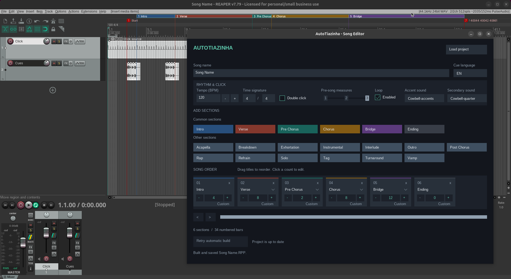

# AutoTiazinha

AutoTiazinha is a set of Lua ReaScripts for preparing songs in REAPER. It builds
a click track, spoken section cues, count cues, regions, tempo information, and
a plain end-of-song marker for Live.

The Native Editor is the recommended way to use the scripts. It provides a
graphical song-arrangement editor using REAPER's built-in `gfx` interface and
rebuilds the project automatically as settings are changed.

## Interface

## Requirements

- [REAPER 7.72](https://www.reaper.fm/download.php) or newer is required.
  The scripts use `reaper.AddRegionOrMarker()`, which was introduced in REAPER
  7.72.
- No separate Lua installation is needed for normal use because REAPER runs the
  scripts. Lua 5.4 is needed only to run the command-line test suite.

The Native Editor uses REAPER's built-in `gfx` API. ReaImGui, JS_ReaScriptAPI,
and ReaPack are not required.

The project includes English and Portuguese cue recordings and works on the
Windows, macOS, and Linux versions of REAPER.

## Installation

1. Download or clone this repository, keeping the Lua files and `media/`
   directory together. Do not move individual scripts away from the media
   folder.
2. Open REAPER and choose **Actions > Show action list**.
3. Select **New action > Load ReaScript**.
4. Load `autoTiazinhaNativeEditor.lua`.
5. Assign it a keyboard shortcut or toolbar button if desired.

The Native Editor also loads these files from the same directory:

- `autoTiazinhaBuilder.lua` — generates and saves the REAPER project.
- `autoTiazinhaEditorModel.lua` — stores and validates editor state.
- `media/EN/` and `media/PT/` — section and count cue recordings.
- `media/click/` — optional click sounds.

Do not load the builder or editor model directly into the Action List.

## Live setlist window (in progress)

Load `autoTiazinhaLive.lua` from the Action List. Use **New / Open** to create a
new setlist file or open an existing one, and **Save** to write changes. A new
setlist's filename becomes its name. The file pickers remember the location of
the last successfully opened or saved setlist across Live launches. Use the
empty **Add .RPP** slot to append an existing project, or **New Song** to create
one in the Native Editor. New songs are saved beside the setlist and added when
the editor closes after a successful build. The same project can appear more
than once. Drag a song by its dotted handle or title to reorder it; use
**Remove** to take that occurrence out of the setlist without deleting its `.RPP`.
A missing song shows **Relink** for that occurrence. **Edit** opens that
occurrence's project tab in the Native Editor. Song changes appear in Live when
the editor closes; changing the song's filename updates that occurrence's path.
Each song
has a **Key** menu showing the root note saved in its `.RPP`, while a chosen
note overrides only that setlist occurrence. Songs without a saved key show
**Choose**. A text menu between songs sets the transition; the final song ends
the setlist without a transition control.
Choose one shared pad `.RPP` in the separate Pad Project box. **Save** writes
setlist edits, including newly added songs; Live prompts before discarding them.
Opening a setlist loads its song projects as REAPER tabs in setlist order, with
one separate shared pad tab. Repeated songs receive separate tabs. Click a song
row to select its tab while stopped, or use **Load Tabs** to load the current
setlist if tabs were changed outside Live. Adding, removing, reordering, or
relinking songs updates the project tabs automatically. A missing song must be
relinked before tabs load; a missing or unselected pad leaves the song tabs
available and shows a warning.
Before replacing existing tabs, Live asks to save each modified project. Cancel
keeps the previous tabs open. If this cancels a reload after the editor saved a
song, the setlist keeps that song and **Reload Tabs** can open it later. Loading
tabs does not start playback.

The transport bar above the setlist has **Play/Pause**, **Full Stop**,
**Previous**, and **Next**. While stopped, Previous/Next or a song row selects
that song's tab without playing it. Play starts the selected song at its
two-measure count-in; Pause holds its position. Resuming rewinds one measure
(or to the start near the beginning) and fades Music in over one measure for
practice. Click and Cues stay at full level, and a playing pad is left alone.
Full Stop stops every playing project tab, including pads, and resets the
selected song to its count-in. Song switching during playback is planned for a
later Live step. Practice resume requires an active output profile.

At a natural end, **Stop at End** keeps the song selected so Play replays it.
**Start Next Automatically** starts the next song's count-in; **Load Next and
Wait** selects the next tab and waits for Play. **Hold** loops the outgoing
song's final Click measure while silencing its Music and Cues outputs. Full
Stop leaves Hold and restores the song's earlier loop and repeat settings.
The final song always uses Stop at End. Pad start, fade, and hold requests are
emitted by the transport, but pad playback and fades arrive in later steps.
Hold requires the active output profile and Click/Cues tracks.

The **Outputs** button at the top right opens hoverable Click/Cues and Music
submenus. They use REAPER's currently selected audio device; choose the device in
REAPER's audio preferences. Live does not switch devices.
By default, Click/Cues use mono **Out 1** (left on a 3.5 mm stereo jack) and
Music uses mono **Out 2** (right). Choose another Click/Cues output or a mono
Music output or an odd/even stereo Music pair (Outs 1/2, 3/4, etc.) when using
a multi-output interface. The menus list REAPER's channel names followed by
their output numbers. These
choices persist on this computer across setlists. The shared pad project uses
the Music output. Live temporarily applies the choices to loaded project tabs
and restores each project's original routing before an editor save, when tabs
are replaced, and when Live closes. If a project is saved directly through
REAPER while Live is open, Live repairs its saved routing on the next update.
An unavailable output leaves the profile inactive and shows a warning.

**Recommended REAPER setting for Live:** To avoid a loading window opening for
each song tab, go to **Options > Preferences > Project > Project loading** and
untick **Show load status and splash while loading projects**. Live still loads
each project normally; this REAPER preference hides the repeated window for all
project loads, not only Live.

## Quick start

1. Open or create a REAPER project and save it in the directory where the song
   projects should live.
2. Run **autoTiazinhaNativeEditor.lua** from the Action List.
3. Enter the song name, tempo, time signature, cue language, and click options.
4. Add sections from the palette. After adding a section, type its length and
   press Enter. The new section is not built until its length is provided.
5. Drag section titles to reorder them. Use `-`, `+`, or the length field to
   change their sizes. Use **Custom** for half-bar sequences.
6. Inspect the generated Click and Cues tracks and the named regions in REAPER.

All committed UI changes rebuild and save the song automatically. Playback is
allowed to continue during a rebuild. Changes made while recording remain
pending and are built when recording stops. If a build fails, correct the
reported problem and use **Retry automatic build**.

Changing the song name can create a new project tab and save a new `.RPP` file
in the current project directory. The editor follows that new project after the
build.

## What a build changes

The builder:

- stores the song settings inside the REAPER project;
- sets the project tempo and time signature;
- creates or regenerates the AutoTiazinha-owned `Click` and `Cues` tracks;
- inserts spoken section cues and beat-count cues;
- creates one named region for each positive-length section;
- recreates the project's markers and tempo/time-signature markers;
- disables repeat and clears the project's loop range;
- adds the plain `AutoTiazinha End` marker; and
- saves the project.

## Count-in

Every build uses the same two-measure count-in. Measure 1 has a half-time `1, 2`
count; measure 2 has the first section cue and its full count; song content
begins at measure 3. The half-time count is centered across its measure. In
4/4, `1` and `2` fall on beats 1 and 3; in 6/8 they fall on beats 1 and 4,
before the following measure counts all six beats. Repeat is disabled and the
project loop range is cleared when the song is built.

Because markers and tempo markers are rebuilt, first use AutoTiazinha on a copy
or disposable project if the project already contains manually created markers
or a custom tempo map.

## Song sections and lengths

The editor discovers available section names from the selected language's media
folder. Common choices include Intro, Verse, Pre Chorus, Chorus, Bridge, and
Ending. Numbered recordings such as `Chorus 1` and `Chorus 2` appear as variants
of their base section.

Normal lengths are whole bars, such as `4`, `8`, or `17`. Custom notation uses
a dot for each half-length bar:

- `8` means eight full bars.
- `4.` means four full bars followed by one half bar.
- `4.2` means four full bars, one half bar, then two full bars.

Half bars require an even time-signature numerator. A final section may have a
length of `0`; this creates its spoken cue and end marker without creating an
empty region. Only the last section can have zero bars.

To add custom section cues, place matching `.wav` files in both language folders
as needed. The file name, without `.wav`, becomes the section name. Avoid `|`,
`:`, commas, slashes, and backslashes in section names.

## Song end markers

New builds place a plain `AutoTiazinha End` marker at the musical song end.
Live detects that marker and uses the song's tempo map for measure boundaries;
SWS is not required. Live warns when a loaded song still has a legacy `!`
action marker, which may make SWS change tabs or stop playback if marker
actions are enabled. Rebuild that song in the Native Editor to replace the old
marker. A song without the new end marker also needs a rebuild for Live end
detection. Live detects ends now; automatic end-mode behavior comes in the next
implementation step.

## Troubleshooting

- **No sections appear:** confirm that `media/EN/` and `media/PT/` are beside
  the scripts and contain `.wav` files.
- **A cue is marked unavailable:** select a variant available in the current cue
  language or add the matching recording.
- **A change says it is waiting to build:** finish the active length/value edit,
  return to the project tab where the editor was opened, or stop recording.
- **Live warns about action markers or a missing end marker:** rebuild the
  affected song in the Native Editor.
- **A build error occurred:** playback may continue, but the project may be
  partially updated. Fix the reported input or missing media and choose
  **Retry automatic build**.
